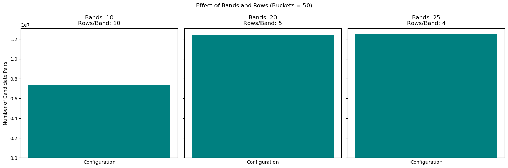

#  HW2: Frequent item-sets + LSH
Some of tasks done in this HW:
- Find the most frequent three-word sets using the priori-A algorithm
```markdown
('galaxies', 'mass', 'type'): 1118
('low', 'mass', 'stars'): 870
('galaxies', 'mass', 'star'): 852
('emission', 'energy', 'ray'): 770
('mass', 'star', 'stars'): 766
('emission', 'galaxies', 'star'): 762
('emission', 'high', 'ray'): 732
('galaxies', 'star', 'type'): 729
('emission', 'observed', 'ray'): 657
...
```
- Using the PCY algorithm, find the most frequent three-word sets.
```markdown
('early', 'galaxies', 'type'): 2131
('formation', 'galaxies', 'star'): 1722
('omega', 'pi', 'rho'): 1580
('eta', 'gamma', 'pi'): 1370
('cluster', 'clusters', 'mass'): 1350
('forming', 'galaxies', 'star'): 1236
('AGN', 'galaxies', 'star'): 1219
('early', 'galaxies', 'mass'): 1157
('galaxies', 'mass', 'type'): 1118
('early', 'mass', 'type'): 1110
```
- Implement code with the help of the LSH algorithm to find similar articles based on their text. 
- Implement the algorithm in such a way that in the input, the ID of an article is given and all the articles similar to it are displayed.
<div style="text-align: center;">
    
</div>
