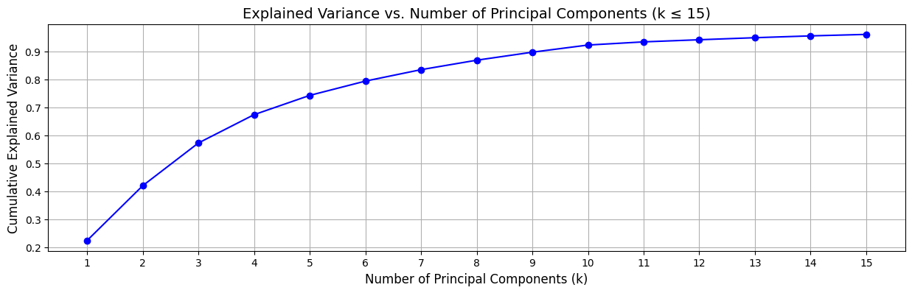
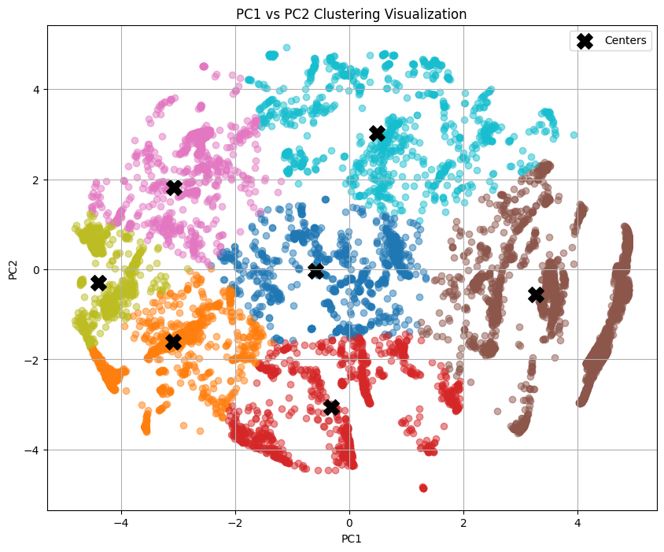

# HW3: Clustering/Dimensionality reduction + Recommender systems!

Some of tasks done in this HW:
- Using the PCA algorithm, choose the value of k in such a way that at least 90% of the variance of the samples is maintained
- Reduce the dimensions of the samples using the obtained eigenvectors.
<div style="text-align: center;">
    
</div>

- Divide the data into three chunks and group the data into 7 clusters using one of the BRF or Cure algorithms.
<div style="text-align: center;">
    
</div>

- Evaluate using metrics *Silhouette Score* and *Davies-Bouldin Index*
```markdown
Silhouette Score: 0.42960626042271594
Davies-Bouldin Index: 4.129832832292689
```
- Separate a part of the dataset as test data, and then design and implement your algorithm for the rest of the dataset, based on the collaborative method.
```markdown
Predicted rating for User AQIY318OX7XYW on Book 0001468685: 1.8137943293929428
```
- Get the RMSE error for the test section.
```markdown
RMSE: 4.0301960237651135
```
