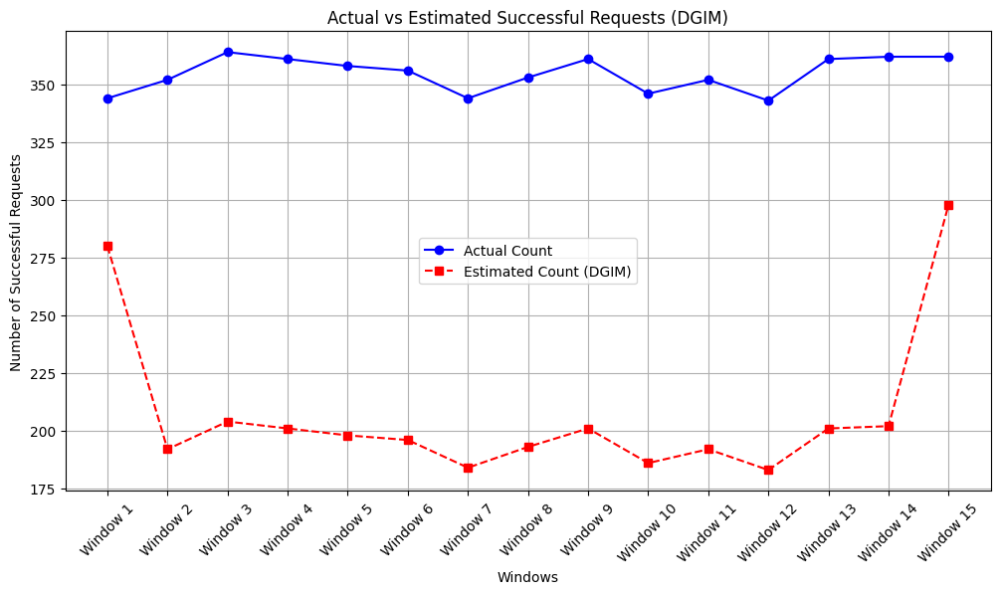

# HW4: Stream data analysis + PageRank/HITS

Some of tasks done in this HW:
- Implementing a streaming data processing system using Structured Streaming in PySpark.
- Process the input data entered into the system continuously and in real time (real-time) from a news source and extract useful information from it.
- Filter the data flow based on different tasks
```markdown
Time: 2024-12-29 12:00:00
Category: PARENTING, Count: 1
Category: CULTURE & ARTS, Count: 1
Category: U.S. NEWS, Count: 5
Category: COMEDY, Count: 1
Category: WORLD NEWS, Count: 2

------------------------------
Time: 2024-12-29 12:00:20
Category: SPORTS, Count: 1
Category: CULTURE & ARTS, Count: 1
Category: U.S. NEWS, Count: 1
Category: WORLD NEWS, Count: 6
Category: TECH, Count: 1

------------------------------
...
```
- Get acquainted with the important algorithms in the analysis of stream data and implement these algorithms(DGIM & FM)
- Estimate the number of 1 bits (successful user requests) in each window using the DGIM algorithm
<div style="text-align: center;">
    
</div>

- Using *FM* algorithm, estimate the number of unique users who have accessed the website.
```markdown
Actual number of unique users: 1491
Estimated number of unique users: 1575.3846153846155
```
- Familiarizing with the PageRank/HITS algorithm and implement it with the help of PySpark and RDD.  
```markdown
Final PageRank Values:
Node 336: 0.0021227393017690947
Node 408: 0.001825388389825673
Node 200: 0.001732312450658645
Node 368: 0.001026613470545319
...
```
```markdown
Final HITS Values:
Node 12: Hub = 0.27278320630152186, Authority = 0.30765685495417094
Node 24: Hub = 0.07940933739439572, Authority = 0.7048000262044748
Node 36: Hub = 0.4725510985034841, Authority = 0.5267444326313117
Node 48: Hub = 0.17918427547367194, Authority = 0.321584176099179
...
```