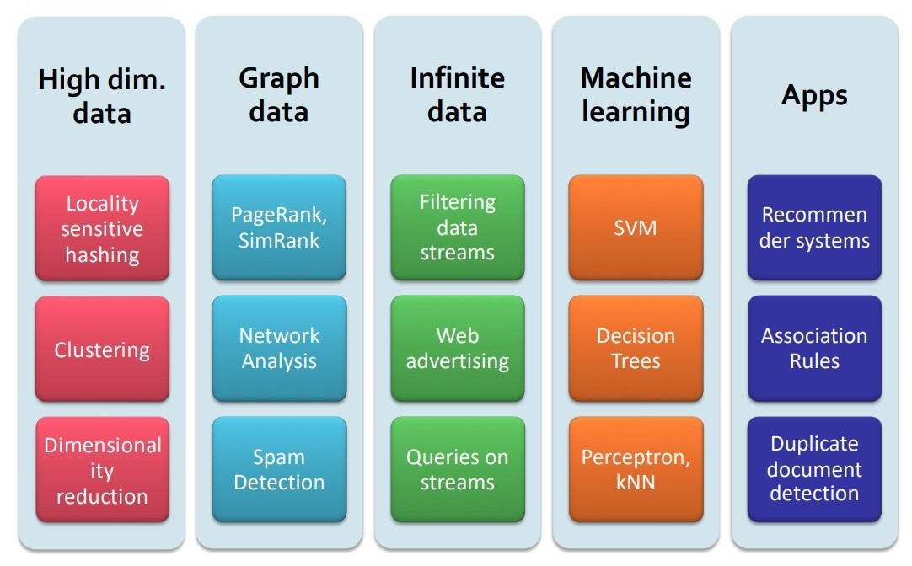

# Massive data analytics: Course overview

    

we have learned these topics in this course:
- Introduction
    - Data Mining
    - Massive Data
    - MapReduce
    - DFS and HDFS
    - Spark
    - Containers, Kubernetes, Virtualization, Hypervisors
    - Side Sessions: Setup, Spark Tutorial, PySpark, Scala
- Frequent Items Mining
- LSHs and Finding Similar Items
- Clustering
- Dimensionality Reduction
- Recommender Systems
- Data Stream Mining
- Page Ranking